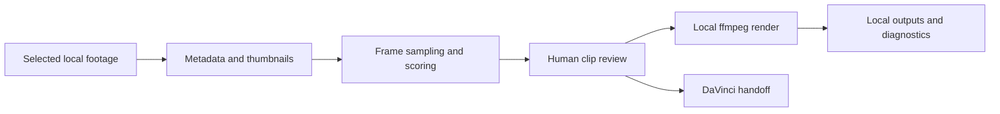

# Drone Hiking Rough Cut

Experimental AI-assisted video triage and rough-cut tool for drone hiking footage. It is local-first: raw footage stays on your machine by default, ffmpeg handles media processing, and OpenCV-based analysis helps surface interesting moments for human editing.

This is not a finished commercial editor. The current goal is to speed up review, rough-cut assembly, and DaVinci Resolve handoff while keeping the workflow understandable and private.

## What It Does

- Scans selected local drone clips.
- Generates thumbnails and metadata.
- Finds candidate moments using motion/change, sharpness, stability, novelty, and optional small-moving-subject hints.
- Lets you label clips for DaVinci review.
- Exports rough cuts, must-review clips, CSV decision lists, and performance reports.
- Supports local music files or a local music library.
- Can export a future remote-job package, but does not upload footage or connect to cloud providers.

## Local-First Privacy

Local Mac processing is the default. Remote processing is only a future-facing package export. Raw footage, rendered outputs, cache files, and music libraries are excluded from Git by `.gitignore`.

## Setup

```bash
python3 -m venv .venv
source .venv/bin/activate
pip install -r requirements.txt
```

Install ffmpeg on macOS:

```bash
brew install ffmpeg
```

Restart Streamlit after installing ffmpeg so the app can detect `ffmpeg` and `ffprobe`.

## Run

```bash
streamlit run app.py
```

## App Sections

The app is organized into tabs:

- `1. Footage Source`: choose `raw_footage/` or pick a custom local folder.
- `2. Select Videos`: review thumbnails and metadata, then check the videos to include.
- `3. Edit Settings`: set duration, shot count, selection rules, aspect ratio, resolution, and color.
- `4. Clip Discovery`: rank interesting moments, label them for review, and export DaVinci handoff clips.
- `5. Music`: choose no music, a local music file, or a track from `music_library/`.
- `6. Generate`: start processing, watch progress/logs, or cancel a running job.
- `7. Results`: preview the export, open the output folder, download the MP4, and review edit decisions.

## Processing Backend

The Generate tab has a backend selector:

- `Local Mac`: default, runs the current local processing pipeline.
- `Remote worker / external compute (experimental)`: does not connect to any provider. It only exports a remote job package under `outputs/remote_job_package/`.

Remote processing may upload private footage to an external machine in the future. Use it only if you trust the provider and understand the cost.



The Streamlit UI orchestrates the workflow, while `processor.py`, `music.py`, and `diagnostics.py` keep export and reporting helpers separate from the page state.

## Footage

Default footage folder:

```text
raw_footage/
```

You can also choose `Use custom local folder path` in the `Footage Source` tab and click `Choose Folder` to open the macOS folder picker. The app scans only the selected folder for `.mp4`, `.mov`, and `.m4v` files. It does not scan `.venv`.

Videos are shown in a selectable table with thumbnail, filename, duration, resolution, and file size. Nothing is included by default. Use the checkboxes or the quick buttons:

- Select all
- Select none
- Select shortest 10
- Select newest 10

Only checked videos are analyzed.

## Thumbnails

Video thumbnails are cached in:

```text
outputs/thumbnails/
```

The cache key includes the video path, modified time, and file size, so changed videos get new thumbnails. If a thumbnail cannot be generated, the app shows a neutral placeholder instead of crashing.

## Music

Music modes:

- No music
- Use my own music file
- Auto-select music

`No music` exports a silent video.

`Use my own music file` lets you choose, upload, or enter a local `.mp3`, `.wav`, `.m4a`, `.flac`, or `.ogg` path. The app validates the file before generation, trims it to the final video duration, and adds short fade-in/fade-out.

`Auto-select music` scans:

```text
music_library/
```

It recursively scans `music_library/` and subfolders, follows symlinks, ignores hidden folders and `.git`, and caches scan results between refreshes. It prefers matching mood metadata, but if metadata is missing it can still choose a random track long enough for the target duration. If no suitable track exists, generation is blocked until you either add tracks, switch to your own music file, or explicitly choose `Continue without music`.

Optional metadata file:

```text
music_library/music_library.csv
```

CSV columns:

```text
filename,title,artist,mood,bpm,license,source_url,attribution_required,attribution_text
```

The app does not scrape or download music. Selected music details and attribution, if required, are written to `outputs/music_used.txt`.

The Music tab includes a `Music Library Setup` section. Use `Open music_library folder` to drop audio files into the library. The optional URL importer only accepts direct audio URLs for tracks you have rights to use; it does not scrape sites or bypass website terms.

## Render Mode

`Fast Preview` uses lower-rate analysis and exports a 720p preview to:

```text
outputs/rough_cut_preview.mp4
```

`Final Quality` uses the normal analysis settings and selected export resolution, writing:

```text
outputs/rough_cut.mp4
```

## Analysis Cache

Per-video analysis results are cached in:

```text
cache/analysis_cache/
```

The cache key uses file path, file size, modified time, duration, clip length, render mode, and the moving-subject setting. Unchanged videos are loaded from cache on later runs.

## Clip Discovery And DaVinci Handoff

The `Clip Discovery` tab ranks candidate moments by motion/change, sharpness/detail, stability/smoothness, visual novelty, and optional small-moving-subject hints. Reasons are written in plain English, such as `smooth forward motion with strong visual change` or `possible small moving subject detected`.

You can label candidates as:

- Must review
- Maybe
- Reject
- Possible animal/bird
- Landscape reveal
- Janky control
- Good opening shot
- Good closing shot

Labels are saved to:

```text
outputs/clip_review.csv
```

`Export Must Review clips` writes individual review clips to:

```text
outputs/must_review_clips/
outputs/davinci_review_list.csv
```

`Create subject-focused preview` is experimental. It exports rough crop/zoom previews for clips labeled `Possible animal/bird` to:

```text
outputs/subject_focus_clips/
```

## Outputs

Generated files stay in:

```text
outputs/
```

Main outputs:

- `outputs/rough_cut.mp4`
- `outputs/rough_cut_preview.mp4`
- `outputs/edit_decisions.csv`
- `outputs/rejected_segments.csv`
- `outputs/clip_review.csv`
- `outputs/davinci_review_list.csv`
- `outputs/contact_sheet.jpg`
- `outputs/music_used.txt`
- `outputs/run_log.txt`
- `outputs/selected_clips/`
- `outputs/must_review_clips/`
- `outputs/subject_focus_clips/`
- `outputs/thumbnails/`
- `outputs/performance_report.csv`
- `outputs/performance_report.txt`
- `outputs/remote_job_package/`

`edit_decisions.csv` lists each selected segment with source filename, start/end time, duration, motion score, sharpness score, variety score, total score, and selection reason.

In the `Results` tab, the app loads `edit_decisions.csv` and shows clip number, source filename, start/end time, duration, total score, reason selected, and a small preview thumbnail where available.

Use `Open output folder` in the `Results` tab to open `outputs/` on macOS. Final Quality rough cuts are written to:

```text
outputs/rough_cut.mp4
```

Silent exports do not keep a separate visible `rough_cut_silent.mp4`; any intermediate file is stored under `outputs/temp/` and removed after successful export.

## Performance Diagnostics

After each run, the app writes:

```text
outputs/performance_report.csv
outputs/performance_report.txt
```

The report times each major stage: scanning, metadata extraction, thumbnail generation, frame analysis, scoring, clip selection, rendering, assembly, music, and final export. It also records file counts, candidate segment counts, output files created, and a lightweight system snapshot with Python version, ffmpeg path/version, CPU count, available memory when detectable, source footage count/size, and export settings.

The `Results` tab shows a Performance Summary with total stage timing, slowest stage, percent of total time, and a plain-English bottleneck diagnosis. If frame analysis dominates, use Fast Preview mode and caching. If rendering dominates, lower export resolution or shorten clips. If assembly dominates, use fewer clips or hard cuts.

## Project Docs

- `docs/product_brief.md`
- `docs/architecture.md`
- `docs/decision_log.md`
- `docs/roadmap.md`
- `docs/performance_notes.md`

## Planned Next

- Improve the experimental subject-focus tool.
- Add better music metadata tagging.
- Continue UX polish around clip review.
- Add provider-specific remote worker execution only after privacy/cost controls are clear.

## Validation

```bash
python3 -m unittest discover -s tests
python3 -m compileall -q app.py processor.py diagnostics.py music.py
```

GitHub Actions runs the same dependency-free smoke checks on every pull request and push to `main`.

## License

MIT — see [LICENSE](LICENSE).

## Processing States

- `IDLE`: no videos are selected.
- `READY`: videos are selected and the app can generate.
- `RUNNING`: a background worker is processing video.
- `DONE`: processing finished successfully.
- `FAILED`: processing stopped with an error; check `outputs/run_log.txt`.
- `CANCELLED`: processing was cancelled by the user.

## If Processing Takes Too Long

Use `Cancel Processing` in the app. You can also reduce export resolution to `1080p`, reduce number of shots, use hard cuts, select fewer source videos, or lower the target duration.
