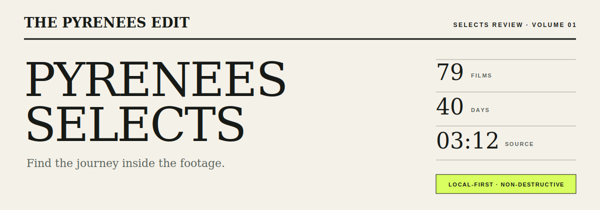
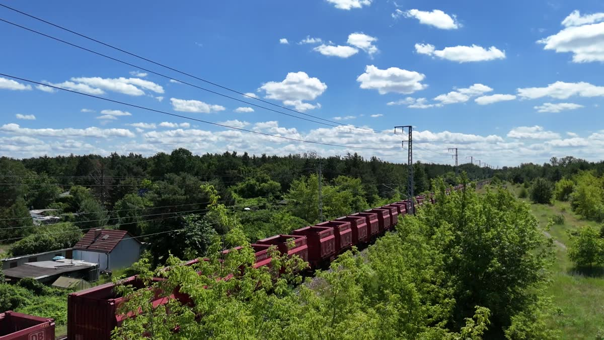

<p align="center">
  
</p>

<p align="center">
  A local-first screening room for turning an overwhelming drone archive into a coherent short-film draft.
</p>

<p align="center">
  <strong>Pyrenees-first</strong> · <strong>sub-480p review</strong> · <strong>originals untouched</strong> · <strong>DaVinci-bound</strong>
</p>



## The project

Pyrenees Selects began with a very specific problem: **79 DJI Mini 4 Pro videos, 85 GB of HEVC footage, and more than three hours of mountains that look similar when viewed as filenames.** The footage covers a 40-day crossing of the Pyrenees. The intended result is a short, coherent film—roughly two minutes, subject to an actual duration experiment—not a folder of disconnected highlight snippets.

Watching every source file is the expensive part. This project therefore concentrates on the work before precision editing:

1. inspect the archive without modifying it;
2. surface sustained candidate sequences at disposable review quality;
3. record Keep, Maybe, and Skip decisions against exact source ranges;
4. assemble duration variants as editable shot cards;
5. hand the chosen ranges to DaVinci Resolve for finishing.

It is reusable by construction, but deliberately **not generalized in advance**. The engineering target is the real Pyrenees 2024 archive on a 2020 Intel MacBook Pro with 16 GB of memory. Other cameras, genres, teams, and cloud workflows can wait until this dataset works exceptionally well.

## The failed first version

The original repository tried to become an “AI video editor” before it understood the useful job. It accumulated music-library management, color controls, automatic montage generation, experimental subject crops, remote-compute packaging, diagnostics, and a seven-tab Streamlit interface.

Most of that behavior lived in a single **2,094-line `app.py`**. The product scope was too broad and the architecture made every experiment harder to trust. It could generate things, but it did not provide a convincing path from a repetitive archive to an intentional film.

The rewrite keeps the lesson and discards the implementation:

- the real bottleneck is footage triage, not another editing timeline;
- a promising moment must remain a source range, not become an orphaned rendered file;
- sustained shots and neighboring-shot compatibility matter more than attractive individual frames;
- automation should reduce review while leaving editorial judgment visible;
- honest baselines are more useful than pretending a heuristic is intelligent.

The legacy implementation remains recoverable in Git history. There is no `legacy/` folder inside the current product.

## What works today

The clean-slate vertical slice currently:

- creates, resumes, and switches between folder-backed local projects;
- scans only top-level `.mp4`, `.mov`, and `.m4v` files;
- reads capture time, duration, codec, dimensions, frame rate, and size with `ffprobe`;
- stores metadata and decisions in SQLite outside both the repository and footage folder;
- runs resumable unattended preparation while preventing the Mac from sleeping;
- sparsely samples low-resolution frames to select a sustained eight-second range from each source using exposure, visible detail, movement, and continuity signals;
- pre-generates 360p H.264 review clips and two context frames in the disposable cache;
- provides the editorial contact-print screening interface;
- records Keep, Maybe, Skip, optional story roles, keyboard controls, and undo;
- binds only to localhost and never serves arbitrary source paths.

On the real archive, all 79 Pyrenees videos scan successfully. The prepared queue contains just under eleven minutes of review footage.

> **Current honesty boundary:** sparse scoring selects a promising sustained range within each source. Cross-source novelty, calibrated recall, storyboard assembly, and Resolve export remain subsequent engineering slices.

## Run it

### Mac app — recommended

On the Intel Mac used for this project, build and install the self-contained personal application:

```bash
./scripts/build_macos_app.sh
./scripts/install_macos_app.sh
```

The result is **Pyrenees Selects.app** in `/Applications`. It presents the interface in a native WebKit window and talks directly to the bundled Python code—there is no listening port, local server, network permission, or background process to manage. The application includes checksum-pinned Intel FFmpeg 8.1.2 tools, so using the installed app does not require Homebrew, Python, or a terminal.

If the chosen library is inside `Documents`, macOS asks once for Documents-folder access. This is the expected file privacy boundary: the app reads the selected originals but writes proxies and decisions only under Application Support.

The local build is ad-hoc signed: no Apple account is needed because it is intended for personal use on the Mac that built it. A public downloadable build would need a separately reviewed FFmpeg distribution plus Apple Developer ID signing and notarization.

### Development server

### 1. Install the system requirement

Python 3.11 or later is required. The first vertical slice has no third-party Python runtime dependencies.

Install `ffmpeg` and `ffprobe` on macOS:

```bash
brew install ffmpeg
```

### 2. Start the local app

From the repository:

```bash
python3 -m pyrenees_selects --source "/path/to/DJI drone"
```

The app opens at [http://localhost:8741](http://localhost:8741). If the browser does not open automatically, visit that address manually.

To use a disposable application-data location:

```bash
python3 -m pyrenees_selects \
  --source "/path/to/DJI drone" \
  --data-dir "/path/to/disposable/app-data"
```

### 3. Screen the candidates

Create the project and scan the folder. Metadata scanning does not transcode the archive. Start **overnight preparation**, leave the Mac plugged in with the app open, and return when the project says **Ready for review**. Work is checkpointed after every file and can be resumed safely.

Preparation decodes sparse 160×90 samples, stores only its scores and exact source ranges, and creates disposable 360p review media under Application Support. It never writes to the footage library. On the target Mac, a 26-minute 4K HEVC source was benchmarked at roughly six times real time using VideoToolbox; the full archive is comfortably an unattended job, though exact runtime depends on thermals and other activity.

| Key | Decision |
|---|---|
| `1` | Skip |
| `2` | Maybe |
| `3` | Keep |
| `Space` | Play or pause |

Story-role labels—Opening, Transition, Peak, and Ending—are optional. Decisions persist immediately and can be undone.

Stop the local server with `Ctrl-C` in the terminal.

## Where the data goes

By default on macOS, metadata and disposable review assets live under:

```text
~/Library/Application Support/Pyrenees Selects/
```

The configured source folder is read-only input. Deleting the application-data folder removes the database and proxies; it does not touch the original footage.

No video file is tracked in this repository. The train image above is a single compressed documentation still included with the repository owner’s explicit permission.

## Product direction

### Review

One candidate sequence at a time: playable low-resolution media, two contextual frames from the same moment, a plain-English rationale, optional story role, and persistent decisions.

### Assembly

Generate 90-second, two-minute, and three-minute storyboard drafts. Allow shots to be reordered, replaced, removed, or locked—without recreating a professional multitrack editor.

### Handoff

Export exact source ranges, frame rates, handles, and metadata into an open editorial representation and a DaVinci Resolve-compatible timeline. Rendered review clips remain disposable.

### Evaluation

Compare the result with free DJI LightCut using processing time, active human time, disk use, candidate acceptance, recall against a labeled subset, duplicate rate, shot-duration distribution, and blind viewer measures.

## Next engineering slices

1. **Candidate calibration** — label a representative subset and measure precision and recall rather than tuning by vibes.
2. **Cross-source novelty** — reduce repetitive mountain views while preserving the geographic journey.
3. **Storyboard assembly** — build coherent duration variants with a loose coast-to-mountains-to-ending journey arc.
4. **Resolve handoff** — export non-destructive editorial ranges with handles.
5. **LightCut benchmark** — run the same representative footage through the free comparison product and publish the results.

## Architecture

The first slice intentionally avoids a frontend build system and account layer:

- Python standard-library localhost server;
- SQLite for durable project and decision state;
- `ffmpeg`/`ffprobe` for media inspection and disposable review assets;
- semantic HTML, CSS, and small vanilla JavaScript interface;
- cache keys derived from source identity, file size, modification time, range, and render policy.

Read the durable decisions:

- [Product brief](docs/product_brief.md)
- [Design lock](docs/design_lock.md)
- [Decision log](docs/decision_log.md)
- [Architecture](docs/architecture.md)

## Test

```bash
python3 -m unittest discover -s tests
python3 -m compileall -q pyrenees_selects tests
node --check pyrenees_selects/static/app.js
```

## Status

Experimental, public, and Pyrenees-first. The repository is public so the product decisions, failed assumptions, evaluation method, and eventual comparison can be inspected—not because the current slice is a finished consumer editor.
