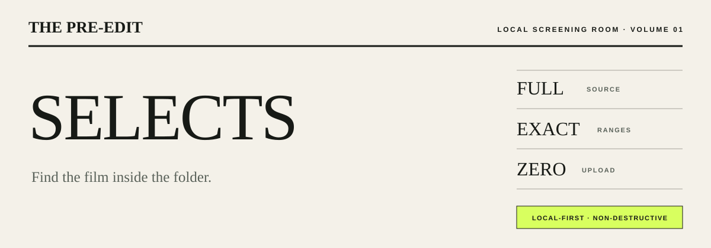

<p align="center">
  
</p>

<p align="center">
  A local, human-first pre-editor for turning a folder of footage into explicit selections and an editable DaVinci Resolve handoff.
</p>

<p align="center">
  <strong>overnight proposals</strong> · <strong>full-source context</strong> · <strong>exact ranges and comments</strong> · <strong>originals untouched</strong>
</p>

> **Alpha status:** the reusable folder → overnight proposals → human review → Resolve workflow works today. The downloadable Intel Mac app still needs Developer ID signing and notarization before normal public distribution.

## What Selects does

Selects is the screening room before the professional timeline. Give it one or more folders containing MP4, MOV, or M4V footage. It helps you:

- inspect the archive without moving or modifying original files;
- calculate a candidate budget from the target film length, shot rhythm, and requested breadth;
- prepare resumable review copies, sparsely measure real visual/audio activity, and render ranked playable proposals one source at a time;
- review a proposed sample or its full source at the same timestamp and adjust exact In/Out points;
- record Keep, Maybe, or Skip, a comment, story role, and source-audio intention;
- assemble Keep and Maybe ranges while unused moments remain visible as alternates;
- save every cut revision as an immutable version; and
- render a disposable preview and export FCPXML plus an open JSON manifest linked to the originals.

Selects is not a replacement for DaVinci Resolve. Resolve already has excellent proxy, Source Tape, and finishing workflows. Selects is useful when first-pass screening and remembering *why* a moment matters are the expensive parts. Read the honest [market and Resolve comparison](docs/market-and-positioning.md).

## Start in five minutes

You need macOS, Python 3.11 or newer, FFmpeg, and ffprobe. The current desktop build targets Intel Macs; the source installation is the supported public-alpha path.

```bash
git clone https://github.com/czzzry/pyrenees-selects.git
cd pyrenees-selects
brew install ffmpeg
./scripts/bootstrap_selects.sh
./scripts/run_selects.sh
```

Selects opens at [http://localhost:8741](http://localhost:8741). Choose **Explore a small sample project** to learn the workflow without exposing personal footage, or create a project from your own folder.

The first-run sequence is deliberate:

1. **Bring a folder.** Nested folders are included; originals remain untouched.
2. **Set planning targets.** Choose the final duration, rough shot rhythm, format, and optional creative direction. Advanced options control proposal breadth and audio-activity weighting.
3. **Check the overnight plan.** Selects shows exact candidate-count bounds, calculated disk use and reserve, duplicate handling, and whether the selected cache can start safely.
4. **Prepare locally.** The checkpointed queue creates review copies, measures sparse samples, and publishes playable proposals as each source completes. It can pause, resume, cancel, retry, or skip failures.
5. **Make the decisions.** Play the proposal, open the full source at the same timestamp, adjust In/Out, add a comment, and choose Keep, Maybe, or Skip.
6. **Assemble and export.** Omitted choices remain alternates; every saved cut is frozen before preview and FCPXML/JSON handoff to Resolve.

See the complete [installation, troubleshooting, update, and removal guide](docs/getting-started.md).

## Optional LLM assistance

Everything above works without an LLM. An assistant is an optional proposal source, not an autonomous editor.

- Codex, Claude, or another agent can read a bounded, path-free project summary through the command interface.
- The built-in OpenAI mode sends that same bounded summary for one request and never stores the API key.
- Proposals stay pending until the user inspects and accepts them.
- Media bytes and local folder paths are excluded from assistant context.

```bash
selects --json project context PROJECT_ID > /tmp/selects-context.json
selects proposal create PROJECT_ID --provider codex --kind sequence --payload proposal.json
```

See the [agent workflow](docs/agent-workflow.md) for the proposal contract.

## Privacy and project data

There is no account, telemetry, or footage upload. On macOS, Selects stores its database, disposable review media, backups, and exports under:

```text
~/Library/Application Support/Selects/
```

Originals remain in the folders you chose. A disconnected drive marks sources offline without erasing decisions. Read [PRIVACY.md](PRIVACY.md) and [SECURITY.md](SECURITY.md) before exposing the localhost service beyond its intended single-computer boundary.

## Current limits

- The project is an alpha, not yet a signed consumer application.
- Candidate ranking is an inspectable heuristic over measured exposure, visible detail, sustained movement, visual consistency, and optional audio activity. It does not identify subjects, understand creative direction, recognize speech, or make editorial decisions.
- Runtime starts as **Estimating…** and becomes a measured per-run ETA only after a source checkpoint. It is not a promise that every codec will process at the same speed.
- The checked-in desktop build is Intel-only. Apple-silicon packaging is outside the declared support boundary for this release.
- Resolve handoff should be verified on representative frame-accurate ranges before relying on it for irreplaceable client work.
- The internal Python package still carries the historical `pyrenees_selects` name while reusable and case-study modules are separated.
- Another current Mac product uses the name **Selects** in a related category. Public promotion requires a naming and brand-clearance decision.

The full release gates are tracked in [productization readiness](docs/productization-readiness.md).

## Pyrenees case study

This project began as a way to screen 85 GB of Pyrenees drone and phone footage on an older Intel Mac. That real film shaped full-source review, comments, alternates, proxy preparation, and Resolve handoff. Film-specific recipes remain in the repository as a reference case; the reusable app does not load them into a new project.

See the [case-study handover](docs/PYRENEES-V8-HANDOVER-2026-07-30.md) if you are studying how the product evolved. New users can ignore it.

## Develop and verify

```bash
python3 -m venv .venv
.venv/bin/python -m pip install -e '.[test]'
make test
```

The current suite covers deterministic candidate planning, real media analysis, durable run recovery, cancellation, disk gating, power lifecycle, project identity, recursive scanning, candidate decisions, frozen sequence versions, assistant proposals, export, sample onboarding, and localhost security.

Interface changes also have an end-to-end Playwright and accessibility gate:

```bash
npm ci
npx playwright install chromium
make test-browser
```

To compare the production flow with its locked visual references:

```bash
make onboarding-prototype
```

Open [http://localhost:4173/prototypes/onboarding/](http://localhost:4173/prototypes/onboarding/) and use the bottom switcher. The references cover project brief, overnight plan, review, running, paused, warning, low-disk, and empty-folder states. The executable implementation contract is [documented here](docs/overnight-product-acceptance.md).

Read [CONTRIBUTING.md](CONTRIBUTING.md), [SUPPORT.md](SUPPORT.md), [CHANGELOG.md](CHANGELOG.md), and the [release guide](docs/release.md) before shipping changes.

## License

[MIT](LICENSE) © 2026 Cezary Baraniecki.
