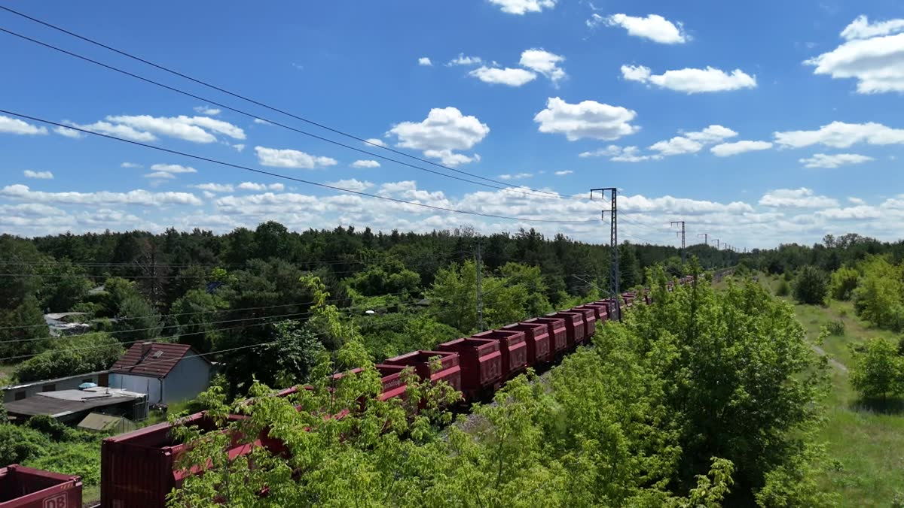

<p align="center">
  
</p>

<p align="center">
  A local-first, LLM-assisted pre-editor for turning a folder of footage into explicit selections, a reversible first cut, and a DaVinci Resolve handoff.
</p>

<p align="center">
  <strong>full-source review</strong> · <strong>comments and exact ranges</strong> · <strong>originals untouched</strong> · <strong>LLM proposals require approval</strong>
</p>



## Reusable app

Selects now supports a new project without editing source code or copying the Pyrenees workflow:

- choose one or more footage folders and scan recursively;
- optionally state a target film length, typical starting clip length, format, and editorial intent;
- play every full original and save several exact In/Out ranges from one source;
- mark Keep, Maybe, or Skip, leave comments, identify story role, and describe how source audio should be treated;
- arrange Keep and Maybe ranges into an ordered cut while omitted material stays available as alternates;
- save every sequence revision as an immutable version;
- render a disposable end-to-end preview with source audio and export FCPXML linked to the originals;
- use the app manually, ask Codex/Claude through the command interface, import a proposal, or connect an OpenAI API key for one request. No proposal changes the project until the user accepts it.

### Install and run

#### Mac desktop app

Build the generic desktop application and a shareable archive:

```bash
./scripts/build_selects_macos_app.sh
open "dist/selects/Selects.app"
```

The app includes its own pinned FFmpeg tools and native folder picker. It stores reusable-project data under `~/Library/Application Support/Selects`, separately from the earlier Pyrenees case study. The local archive is ad-hoc signed; a public download still requires Apple Developer ID signing and notarization as described in [the release guide](docs/release.md).

#### Python installation

Python 3.11+, `ffmpeg`, and `ffprobe` are required. From this repository:

```bash
./scripts/bootstrap_selects.sh
./scripts/run_selects.sh
```

Or install the command directly:

```bash
python3 -m pip install .
selects doctor
selects serve
```

The reusable app opens at [http://localhost:8741](http://localhost:8741). Its data lives outside the footage folder. The earlier Pyrenees-specific app and scripts remain available as a case study.

### Codex or Claude

An agent can inspect a bounded, path-free project summary and submit a proposal through stable commands:

```bash
selects --json project context PROJECT_ID > /tmp/selects-context.json
selects proposal create PROJECT_ID --provider codex --kind sequence --payload proposal.json
```

The proposal stays pending until it is accepted in the app or explicitly applied with `selects proposal apply PROPOSAL_ID`. See [the agent workflow](docs/agent-workflow.md) and [the reusable product contract](docs/reusable-pre-editor-spec.md).

## The Pyrenees case study

Pyrenees Selects began with a very specific problem: **79 DJI Mini 4 Pro videos, 85 GB of HEVC footage, and more than three hours of mountains that look similar when viewed as filenames.** The footage covers a 40-day crossing of the Pyrenees. The intended result is a short, coherent film—roughly two minutes, subject to an actual duration experiment—not a folder of disconnected highlight snippets.

Watching every source file is the expensive part. This project therefore concentrates on the work before precision editing:

1. inspect the archive without modifying it;
2. surface sustained candidate sequences at disposable review quality;
3. record Keep, Maybe, and Skip decisions against exact source ranges;
4. revisit Keeps and Maybes and attach natural-language editing notes;
5. assemble duration variants as editable shot cards;
6. hand the chosen ranges to DaVinci Resolve for finishing.

That film remains the reference case that shaped the product. Dataset-specific treatments and finishing scripts are intentionally kept separate from the reusable `PreEditor` domain model.

## What works today

The clean-slate vertical slice currently:

- creates, resumes, and switches between folder-backed local projects;
- scans only top-level `.mp4`, `.mov`, and `.m4v` files;
- reads capture time, duration, codec, dimensions, frame rate, and size with `ffprobe`;
- stores metadata and decisions in SQLite outside both the repository and footage folder;
- runs resumable unattended preparation while preventing the Mac from sleeping;
- sparsely samples low-resolution frames to select a sustained eight-second range from each source using exposure, visible detail, movement, and continuity signals;
- pre-generates disposable 360p H.264 review clips and streams the untouched full original on demand in the review screen;
- provides the editorial contact-print screening interface;
- records Keep, Maybe, Skip, optional story roles, keyboard controls, and undo;
- preserves the completed screening outcome, then offers a second pass over the 52 Keeps and Maybes;
- autosaves plain-text comments during screening and carries them into the second-pass editing notes, where an optional source-time marker can be attached;
- seeds the reviewed Pyrenees edit plan beside those protected decisions: 20 core shots, 25 alternates, six drops, and one deliberately deferred bird shot;
- prepares changed proposed ranges as resumable disposable 360p previews, with a measured 20–30 minute estimate on the target Mac;
- presents the two-minute storyboard one shot at a time with the preserved second-pass note, a separate autosaving shot comment, the proposed treatment, and explicit shot decisions;
- renders the fully approved 20-shot sequence as a resumable, disposable 360p treated rough cut with the requested trims, extensions, speed changes, crops, and light stabilization;
- derives a separate 34-shot, 3:47 longer rough cut by reusing the locked North Star treatments, adding selected alternates, and preserving the extended bird climax;
- exposes only the 13 shots unique to that longer cut in a focused hybrid review, playing their finished treatments and saving Add, Long only, or Unsure choices separately from every earlier decision and note;
- assembles the completed focused choices into a separate 30-shot, 3:25.44 hybrid while preserving every earlier export;
- binds only to localhost and never serves arbitrary source paths.

On the real archive, all 79 Pyrenees videos scan successfully and have been screened: 27 Keeps, 25 Maybes, and 27 Skips. The prepared queue contains just under eleven minutes of review footage.

> **Current honesty boundary:** the reusable assistant reasons over filenames, metadata, the user’s exact ranges, decisions, and comments; it does not pretend to see footage that was not sent to it. The Pyrenees storyboard and special wildlife treatments remain dataset-specific. Reusable previews are lightweight review media, while Resolve handoffs link back to original files for finishing.

## Run it

### One-command synthetic demo

Reviewers can explore the current screening flow without drone footage:

```bash
make demo
```

The command generates four tiny moving test-pattern clips under `.demo/`, scans them into an isolated local database, and opens the screening room at [http://localhost:8741](http://localhost:8741). It uses no personal media, makes no network request, and never writes outside the ignored demo directory.

The synthetic footage is intentionally unmistakable. It proves the scan, metadata, candidate, decision, and local-media paths; it is not presented as evidence that the visual heuristic has been calibrated on arbitrary footage.

### Pyrenees case-study Mac app

The earlier film-specific application can still be built for reproducing the case study:

```bash
./scripts/build_macos_app.sh
./scripts/install_macos_app.sh
```

The result is **Pyrenees Selects.app** in `/Applications`. New projects should use the generic **Selects.app** build documented above.

If the chosen library is inside `Documents`, macOS asks once for Documents-folder access. This is the expected file privacy boundary: the app reads the selected originals but writes proxies and decisions only under Application Support.

The local build is ad-hoc signed: no Apple account is needed because it is intended for personal use on the Mac that built it. A public downloadable build would need a separately reviewed FFmpeg distribution plus Apple Developer ID signing and notarization.

### Development server

### 1. Install the system requirement

Python 3.11 or later is required. The first vertical slice has no third-party Python runtime dependencies.

Install `ffmpeg` and `ffprobe` on macOS:

```bash
brew install ffmpeg
```

### 2. Start the local app

From the repository:

```bash
python3 -m pyrenees_selects --source "/path/to/DJI drone"
```

The app opens at [http://localhost:8741](http://localhost:8741). If the browser does not open automatically, visit that address manually.

To use a disposable application-data location:

```bash
python3 -m pyrenees_selects \
  --source "/path/to/DJI drone" \
  --data-dir "/path/to/disposable/app-data"
```

### 3. Screen and refine the candidates

Create the project and scan the folder. Metadata scanning does not transcode the archive. Start **overnight preparation**, leave the Mac plugged in with the app open, and return when the project says **Ready for review**. Work is checkpointed after every file and can be resumed safely.

Preparation decodes sparse 160×90 samples, stores only its scores and exact source ranges, and creates disposable 360p review media under Application Support. It never writes to the footage library. On the target Mac, a 26-minute 4K HEVC source was benchmarked at roughly six times real time using VideoToolbox; the full archive is comfortably an unattended job, though exact runtime depends on thermals and other activity.

| Key | Decision |
|---|---|
| `1` | Skip |
| `2` | Maybe |
| `3` | Keep |
| `Space` | Play or pause |

Story-role labels—Opening, Transition, Peak, and Ending—are optional. Decisions persist immediately and can be undone.

After all 79 decisions are complete, choose **Refine 52 selected moments**. This second pass shows only the original Keeps and Maybes, keeps those screening outcomes protected, and autosaves a plain-text editing note beside each prepared 360p selection. Write naturally—for example, “let the zoom-out run longer,” “could this movement be smoother?”, or “zoom toward the bird.” **Attach current moment** optionally records the source time you were viewing. The note remains an editorial request, not an automatically applied edit.

Once all 52 selections have been revisited, choose **Prepare the two-minute cut**. The app prepares only the proposed ranges that differ from the first-pass previews. The first complete run on the target Mac took 20 minutes 49 seconds from click to ready, including the one-time Documents-folder permission, so the disclosed planning range is 20–30 minutes and rented compute is not needed. Review the resulting 20-shot storyboard with **Approve shot and planned edits**, **Remove from cut**, or **Choose another shot**. The screen explicitly distinguishes the range already visible from the treatment still planned, and each shot has a separate autosaving comment box that does not overwrite the original second-pass note. The bird enhancement remains outside this pass by design.

After all 20 shots were approved, the first complete treated rough cut rendered locally in **9 minutes 4 seconds**. It is **2 minutes 32.2 seconds** long because the approved extensions and slower holds increased the earlier two-minute planning target. Candidate #74 uses its complete three-second source slowed to exactly five seconds with motion interpolation; no nonexistent front or back footage is implied. This measured run confirms that rented compute is not needed for the non-bird 360p treatment pass.

Candidate #78 now also has a separate **4.57-second faithful 1080p master**. It uses the verified 00:59.2–01:01.736 source interval, stabilizes the background, tracks the bird densely, eases from a wide mountain-and-cloud view into the close crop, and slows the result with motion interpolation. The defined production passes took under ten minutes locally. Its 360p review copy is inserted after candidate #74 in a separate **2 minute 36.76 second bird-inclusive North Star**; the original 2:32.2 cut remains unchanged.

An owner-requested **7.97-second extended bird master** is preserved alongside it. The extension adds the earlier stabilized flight over clouds from 00:55.5–00:58.9, uses a deliberate match cut across 00:58.9–00:59.2 during the camera move, and then continues into the existing mountain-backed close treatment. Its separate bird-inclusive North Star is **2 minutes 40.16 seconds**. The original North Star and shorter bird version remain unchanged.

A separate **3 minute 47.16 second longer rough cut** is also complete. It reuses all 20 locked North Star treatments, adds 13 selected alternates for more geography, people, water, and breathing room, and places the extended bird immediately before the original cloud-sea ending. The local resumable render took **7 minutes 1 second**, so rented compute is not needed. All shorter exports remain preserved.

To shape the hybrid, open the installed app and choose **Choose 13 long-only shots for the hybrid**. It plays the exact finished 360p treatment from the longer cut—not an earlier source preview—and offers **Add to hybrid**, **Long version only**, or **Unsure for now**. Choices and optional notes save locally in their own record. They do not change the original Keep/Maybe/Skip outcome, second-pass note, approved North Star storyboard, or either rendered cut.

That focused review is now complete. Nine additions were accepted (#8, #11, #15, #19, #37, #52, #72, #75, and #76), while four remain exclusive to the long cut (#41, #46, #57, and #73). The resulting separate **3 minute 25.44 second hybrid** contains 30 shots and retains the extended bird climax. It also applies the two focused comments: #37 is trimmed to exactly five seconds, and #52 is stabilized and slowed to 80% for a 6.28-second result. The local resumable render took **5 minutes 15 seconds**; rented compute is not needed, and the 2:40.16 and 3:47.16 cuts remain unchanged.

Stop the local server with `Ctrl-C` in the terminal.

## Where the data goes

By default on macOS, metadata and disposable review assets live under:

```text
~/Library/Application Support/Pyrenees Selects/
```

The configured source folder is read-only input. Deleting the application-data folder removes the database and proxies; it does not touch the original footage.

No video file is tracked in this repository. The train image above is a single compressed documentation still included with the repository owner’s explicit permission.

## What changed from the first version

The original repository tried to become an “AI video editor” before it understood the useful job. It accumulated music-library management, color controls, automatic montage generation, experimental subject crops, remote-compute packaging, diagnostics, and a seven-tab Streamlit interface.

Most of that behavior lived in a single **2,094-line `app.py`**. The product scope was too broad and the architecture made every experiment harder to trust. It could generate things, but it did not provide a convincing path from a repetitive archive to an intentional film.

The rewrite keeps the lesson and discards the implementation:

- the real bottleneck is footage triage, not another editing timeline;
- a promising moment must remain a source range, not become an orphaned rendered file;
- sustained shots and neighboring-shot compatibility matter more than attractive individual frames;
- automation should reduce review while leaving editorial judgment visible;
- honest baselines are more useful than pretending a heuristic is intelligent.

The legacy implementation remains recoverable in Git history. There is no `legacy/` folder inside the current product.

## Product direction

### Review

One candidate sequence at a time: playable low-resolution media, two contextual frames from the same moment, a plain-English rationale, optional story role, and persistent decisions.

### Refinement

One preserved Keep or Maybe at a time: replay the prepared selection and autosave a natural-language editing note without changing the screening outcome. Notes remain durable planning input for later footage-aware analysis and storyboard work.

### Assembly

Start with a guided review of the 20-shot two-minute plan. Approve, replace, remove, or restore each proposed source range, then derive the 90-second and three-minute variants without recreating a professional multitrack editor.

### Handoff

Export exact source ranges, frame rates, handles, and metadata into an open editorial representation and a DaVinci Resolve-compatible timeline. Rendered review clips remain disposable.

### Evaluation

Compare the result with free DJI LightCut using processing time, active human time, disk use, candidate acceptance, recall against a labeled subset, duplicate rate, shot-duration distribution, and blind viewer measures.

## Next engineering slices

1. **Review the completed hybrid** — compare the 3:25.44 hybrid with the 2:40.16 North Star and decide whether any final structural adjustment is needed.
2. **Resolve handoff** — export the chosen structure as non-destructive source ranges with handles and treatment notes, linked back to the untouched originals.
3. **Precision finishing in Resolve** — confirm frame-level cuts, stabilization, reframing, color, sound, and music at full resolution.
4. **Optional bird enhancement** — only after the faithful version is accepted, decide whether a clearly labeled AI-enhancement experiment is worth attempting.
5. **Candidate calibration and novelty** — measure first-pass recall and duplicate reduction for future projects.
6. **LightCut benchmark** — run the same representative footage through the free comparison product and publish the results.

## Architecture

The first slice intentionally avoids a frontend build system and account layer:

- Python standard-library localhost server;
- SQLite for durable project and decision state;
- `ffmpeg`/`ffprobe` for media inspection and disposable review assets;
- semantic HTML, CSS, and small vanilla JavaScript interface;
- cache keys derived from source identity, file size, modification time, range, and render policy.

Read the durable decisions:

- [Product brief](docs/product_brief.md)
- [Design lock](docs/design_lock.md)
- [Decision log](docs/decision_log.md)
- [Architecture](docs/architecture.md)

## Test

```bash
make test
```

## Status

Reusable local alpha. The generic workflow is implemented and tested, while the repository deliberately retains the film-specific Pyrenees work as its reference case. Public macOS distribution still needs Developer ID signing/notarization and an Apple-silicon build. See [privacy](PRIVACY.md), [security](SECURITY.md), and [release readiness](docs/release.md).
